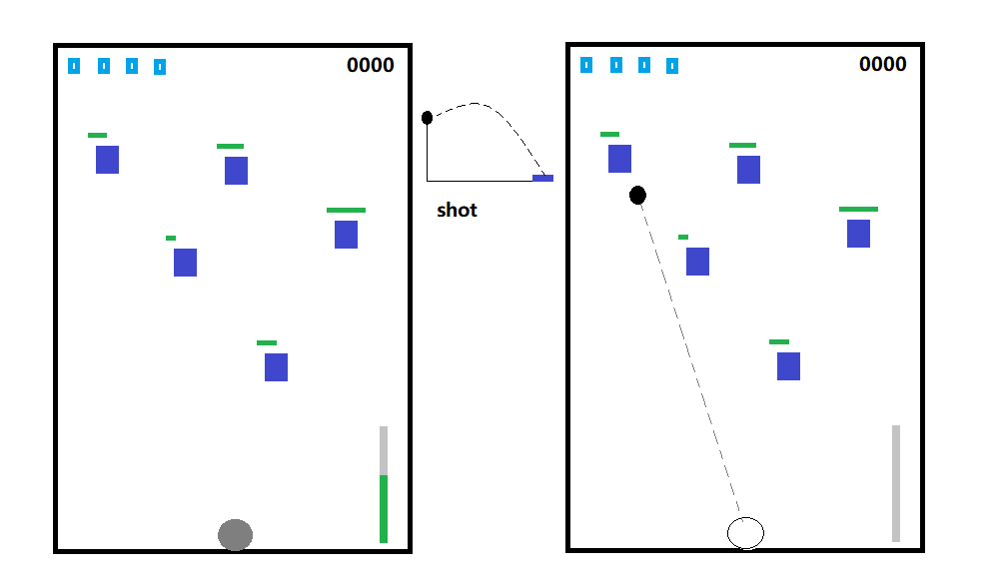

# Falling Ball

## Description

A shot game developped by ggez(a 2d game engine).

## Target

The following picture is the expected UI of this game.

## issue

- [x] Data Bar
- [x] Timer Bar
- [x] Ball
- [ ] Box
- [ ] Power Recorder
- [ ] Main State

## examples

You can use `cargo run --exampel <target>` to view the completed material

## ball

Flying the ball by the direction you click.

## bar

Countdown 5 sec after clicked and show the Y coordinate over the windows hight.

