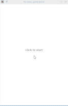

# Falling Ball

## Description

A shot game developped by ggez(a 2d game engine).

## short view

The game is nearly completed with a little modification to be more enjoyable. As for this currelt version, it's a little bit difficult for me.Otherwise,the best scre for me is 20 by recently. Enjoy youself. ^_^

## issue

- [x] Data Bar
- [x] Timer Bar
- [x] Ball
- [x] Block
- [x] Power Recorder
- [x] Main State
- [x] Basic sould effects

## examples

You can use `cargo run --exampel <target>` to view the completed material

## ball

Flying the ball by the direction you click.

## bar

- countdown 5 sec after clicked shown in vertical timer bar;
- record the time(less than 5 sec) between left mouse button down and up;
- show the Y coordinate over the windows hight in vertical bar;
- show the X coordinate over the windows hight in horizontal bar;

## block

__This is not a game, but you can still have a little fun with it.__

Click the left mounse button to start the 'game'. Click to `block` to get the score. Every block would live for 2 Sec. If lost it after it's living time, the lost record would increase.

Have fun with it!!! :)

